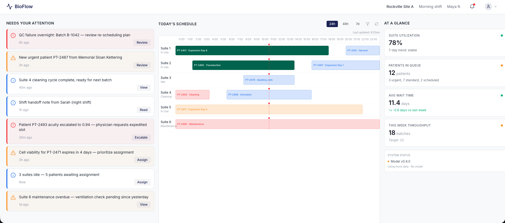
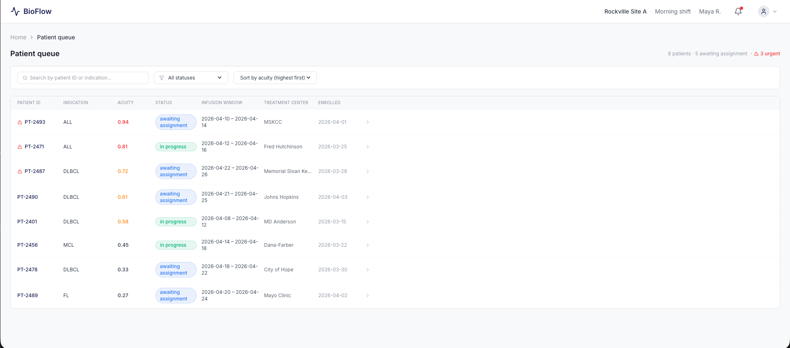
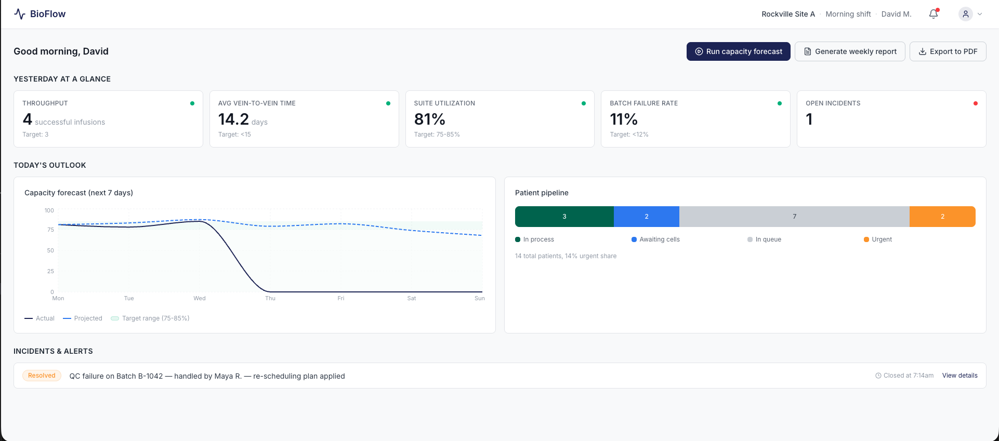
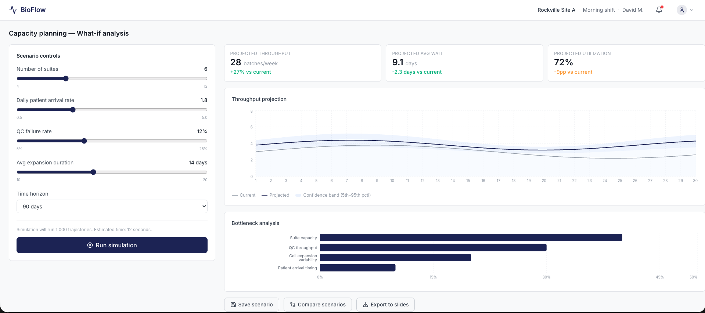
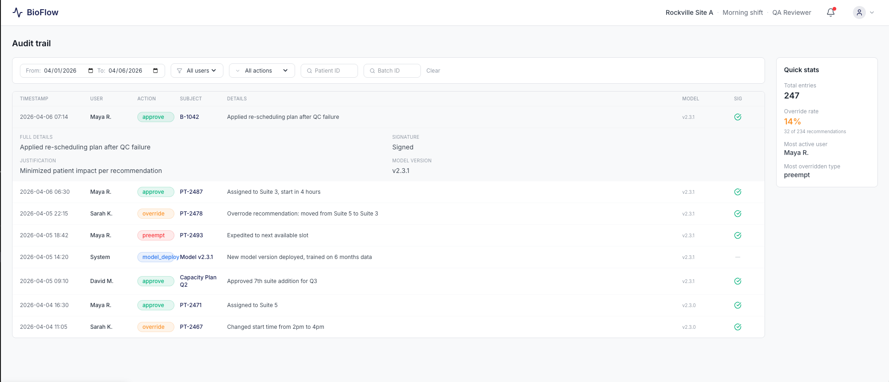

# BioFlow Scheduler

**AI-driven scheduling optimization for CAR-T cell therapy manufacturing.**

BioFlow uses reinforcement learning (PPO) to schedule patient batches across cleanroom suites, reducing wait times and increasing throughput without adding physical capacity. It sits on top of existing orchestration platforms (Vineti, TrakCel) as an intelligence layer — coordinators review every recommendation before it's applied.

> At CAR-T facility construction costs of $50-300M per site, even a 10% throughput gain represents tens of millions in avoided capex.

---

## Quick Start

```bash
# Clone and run everything
git clone https://github.com/garciar8-port/car_t_platform.git
cd car_t_platform
docker compose up --build
```

That's it. Open [http://localhost](http://localhost) for the dashboard, [http://localhost:8000/docs](http://localhost:8000/docs) for the API.

**Without Docker** (local dev):

```bash
# Terminal 1 — API
PYTHONPATH=services/scheduler/src uvicorn main:app --port 8000 --app-dir services/api

# Terminal 2 — Frontend
cd services/frontend && npm install && npx vite
```

Frontend at [http://localhost:5173](http://localhost:5173), API at [http://localhost:8000](http://localhost:8000).

---

## What It Does

Autologous CAR-T manufacturing is a make-to-order process: each patient's own T-cells are extracted, genetically modified, expanded over ~14 days in a dedicated cleanroom suite, and returned for infusion. Scheduling is hard because:

- **Batch durations are stochastic** — cell expansion varies 10-21 days per patient
- **QC failures are late and costly** — 10-15% of batches fail release testing at the end
- **Patient acuity changes over time** — sicker patients can't afford to wait
- **Cleanroom suites are the bottleneck** — each handles one batch at a time

BioFlow models this as a Markov Decision Process and trains a PPO agent on a SimPy digital twin of the facility. The agent learns scheduling policies that outperform hand-crafted heuristics (FIFO, highest-acuity-first, shortest-processing-time).

### Two user personas

| Role | View | Key actions |
|------|------|-------------|
| **Manufacturing Coordinator** | Gantt schedule, patient queue, action cards | Approve/override/flag RL recommendations |
| **Manufacturing Director** | KPI dashboard, capacity planning, reports | Run what-if simulations, monitor throughput |

---

## Screenshots

### Coordinator Dashboard
Three-column layout: action cards requiring attention, Gantt schedule with batch status across all suites, and real-time KPIs.



### Patient Assignment
RL recommendation with SHAP explanation, alternative suites with tradeoffs, and approve/override/flag workflow.



### Director KPIs
Executive view with throughput, vein-to-vein time, utilization, failure rate, capacity forecast, and patient pipeline.



### Capacity Planning
What-if sandbox: adjust suite count, arrival rate, QC failure rate, and expansion duration, then run SimPy simulations to project throughput.



### Audit Trail
Filterable, 21 CFR Part 11-compliant audit log with hash-chain integrity, e-signature status, and override justifications.



---

## Architecture

```
                    ┌──────────────────────────────────────────────┐
                    │               React Dashboard               │
                    │  Coordinator view  ·  Director view  ·  Audit│
                    └──────────────────┬───────────────────────────┘
                                       │ REST API
                    ┌──────────────────▼───────────────────────────┐
                    │              FastAPI Service                  │
                    │  Recommendations · Approval workflow · KPIs  │
                    │  Audit trail · Auth (JWT) · Telemetry        │
                    └──────┬───────────────────────┬───────────────┘
                           │                       │
              ┌────────────▼──────────┐  ┌─────────▼──────────┐
              │   Scheduler Library   │  │   PostgreSQL        │
              │                       │  │   Audit trail       │
              │  PPO Agent (SB3)      │  │   State snapshots   │
              │  SimPy Simulator      │  └────────────────────-┘
              │  SHAP Explainer       │
              │  Gymnasium Env        │
              │  MDP Schemas          │
              └───────────────────────┘
```

**Key design decisions:**
- **Human-in-the-loop is mandatory** — every RL recommendation requires coordinator approval
- **Scheduler is standalone** — usable as a Python library without the API or frontend
- **SHAP explainability is architectural** — computed alongside every recommendation, not as an afterthought
- **21 CFR Part 11 compliance** — immutable audit trail with SHA-256 hash chains

---

## Tech Stack

| Layer | Technology |
|---|---|
| **RL Agent** | Stable Baselines3 · MaskablePPO · SHAP KernelExplainer |
| **Simulation** | SimPy (discrete-event) · OpenAI Gymnasium |
| **API** | FastAPI · Pydantic · SQLAlchemy · JWT auth |
| **Frontend** | React 19 · TypeScript · Tailwind CSS · Recharts · Vite |
| **Database** | PostgreSQL 16 · Alembic migrations |
| **ML Ops** | MLflow (model registry + experiment tracking) |
| **Monitoring** | OpenTelemetry · Grafana |
| **Infrastructure** | Docker Compose · Redis · AWS (ECS, RDS, S3) planned |

---

## Repository Structure

```
services/
├── scheduler/          # RL agent, simulator, MDP — standalone Python library
│   ├── src/bioflow_scheduler/
│   │   ├── mdp/        # Pydantic state/action/reward schemas
│   │   ├── policy/     # PPO agent wrapper, evaluation, heuristic baselines
│   │   ├── simulator/  # SimPy digital twin, Gymnasium env, stress scenarios
│   │   └── explainer/  # SHAP feature attribution
│   └── tests/          # 75 tests (schemas, simulator, heuristics)
├── api/                # FastAPI backend
│   ├── main.py         # Endpoints, SimulatorManager
│   ├── auth.py         # JWT authentication
│   ├── audit.py        # Audit trail service (SHA-256 hash chain)
│   └── telemetry.py    # OpenTelemetry instrumentation
└── frontend/           # React dashboard
    └── src/
        ├── pages/      # 11 pages (coordinator, director, audit, mobile)
        ├── components/ # AppShell, ActionCard, Badge, KpiTile, ConfidencePill
        ├── hooks/      # useApi data fetching hook
        └── services/   # API client

training/
├── configs/            # Training hyperparameter configs (JSON)
├── scripts/            # train.py, stress_test.py
└── results/            # Saved models + benchmark reports

infra/
└── grafana/            # Grafana provisioning (datasources)
```

---

## MDP Formulation

| Component | Description |
|---|---|
| **State** | Suite statuses, patient queue (acuity scores, wait times), inventory levels, clock |
| **Actions** | Assign patient to suite, or no-op (wait for next decision point) |
| **Reward** | Penalize wait time (acuity-weighted), idle suites, failures; reward infusions |
| **Transitions** | LogNormal expansion durations, Bernoulli QC (p=0.90), Poisson arrivals |
| **Discount** | gamma = 0.95, 8-hour decision intervals, 90-day episodes |

---

## Development Status

The project is through Phase 4 of the roadmap. See `PROJECT_CONTEXT.md` for full details.

| Phase | Status |
|---|---|
| 1. Problem formalization & MDP spec | Done |
| 2. SimPy simulator + Gymnasium wrapper + baselines | Done |
| 3. MaskablePPO training + action masking | Done |
| 4. SHAP explainability + stress testing | Done |
| 5. FastAPI service + React dashboard | Done |
| 6. Production hardening (DB persistence, CI/CD, AWS) | In progress |

---

## License

Proprietary. All rights reserved.
